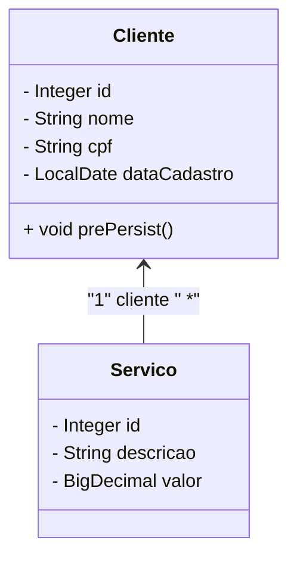

# Clientes API
API RESTFul para cadastro e controle de clientes

## Diagrama de classes

```mermaid
classDiagram
    class Cliente {
        - Integer id
        - String nome
        - String cpf
        - LocalDate dataCadastro
        + void prePersist()
    }

    class Servico {
        - Integer id
        - String descricao
        - BigDecimal valor
    }

    Cliente <-- Servico : "1" cliente " *"
```
